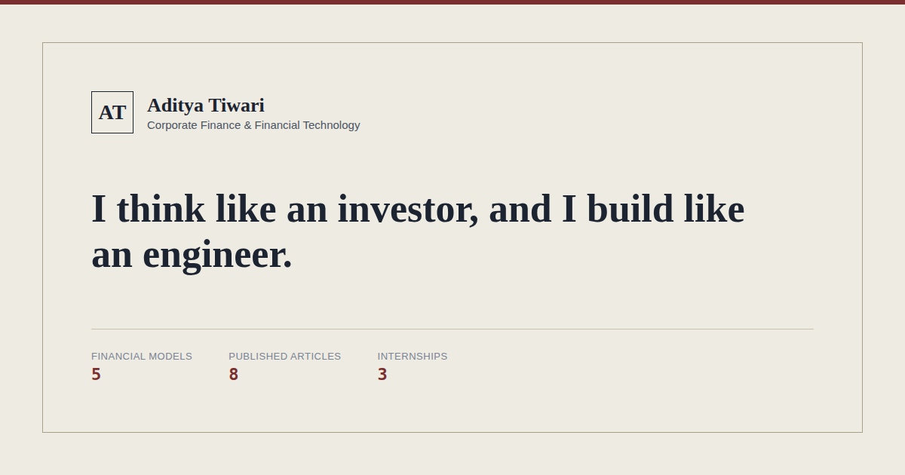

<div align="center">

# Aditya Tiwari — Portfolio

**Corporate Finance × Financial Technology**

*I think like an investor, and I build like an engineer.*

[Live Site](https://aditya-tiwari-portfolio.vercel.app/) · [LinkedIn](https://www.linkedin.com/in/adityatiwari19/) · [Email](mailto:adityatiwari9205@gmail.com)



</div>

---

## About this project

This is my personal portfolio — built from scratch with plain HTML, CSS, and JavaScript,
no framework, no build step. It's meant to work as a digital resume: real financial models
I've built, case-study write-ups, my actual experience, and the public writing I do on
LinkedIn, all in one place instead of scattered across links.

The design is styled like an editorial research note — paper background, serif headlines,
hairline rules — because that's the visual language of the work itself (memos, models,
research reports), not a generic template.

## Features

- **About** — a short intro with a photo
- **Profile** — the pattern behind how I approach problems
- **Experience** — internships, in bullet-point form, with company marks
- **Education** — degree and school
- **Projects** — finance case studies (LBO, DCF, M&A, equity research, IPO valuation,
  PE screening), each with a quick-view summary, the full write-up, and the underlying
  Excel model, filterable by the kind of work rather than by industry
- **Insights** — my published LinkedIn case studies, filterable by topic
- **Toolkit** — the technical side (Python, SQL, financial modeling, automation)
- **Contact** — email, LinkedIn, and a downloadable résumé
- Fully responsive, works down to mobile
- No frameworks, no build tools — open `index.html` and it just runs

## Built with

- HTML5 / CSS3 (custom properties, no CSS framework)
- Vanilla JavaScript (no dependencies)
- Google Fonts (Newsreader, IBM Plex Sans, IBM Plex Mono)

## Project structure

```text
portfolio/
├── index.html          # the site
├── style.css
├── script.js            # content lives here — see "Adding content" below
├── admin.html            # private content-editing helper — see note below
├── images/
│   ├── og-image.png       # social share preview
│   ├── photo.jpg           # profile photo
│   └── companies/            # company marks for the Experience section
├── assets/
│   └── *.pdf                  # résumé
├── reports/
│   └── *.pdf                    # full project write-ups
└── models/
    └── *.xlsx                     # underlying financial models
```

## Running locally

No install, no build step — clone the repo and open `index.html` in a browser.

```bash
git clone https://github.com/<your-username>/<your-repo>.git
cd <your-repo>
open index.html   # or just double-click it
```

## Adding content

All project and insight entries live as plain JavaScript objects near the top of
`script.js`. There's also a small local helper, `admin.html`, that turns a form into
the exact code snippet to paste in — no manual JS required.

> **Note on `admin.html`:** it's a private editing tool, not part of the live site
> experience — it isn't linked from anywhere on the page. If you fork this repo, you
> may want to `.gitignore` it or keep it out of your deployed build, since anything in
> the repo is technically reachable once hosted.

## Deployment

Static site — deploys anywhere that serves plain files: GitHub Pages, Vercel, Netlify,
Cloudflare Pages, etc. No environment variables, no server, no database.

## Contact

- Email: [adityatiwari19@gmail.com](mailto:adityatiwari19@gmail.com)
- LinkedIn: [Aditya Tiwari](https://www.linkedin.com/in/adityatiwari19/)
